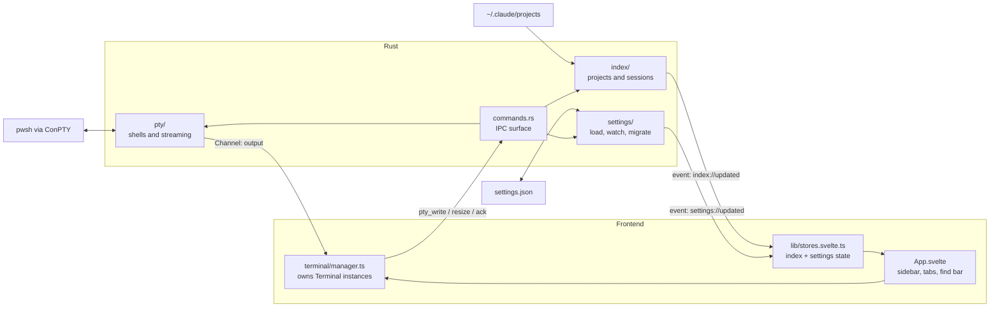
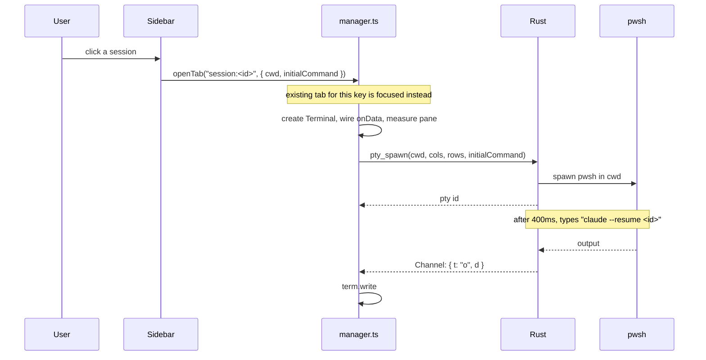
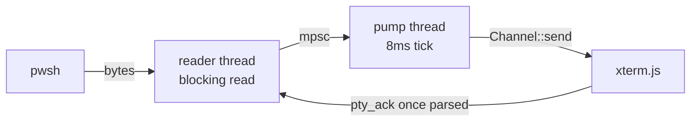

# Architecture

ATC is a Tauri application. Rust owns everything stateful — the shells, the session
index, the settings file. The Svelte frontend draws the sidebar and hosts the terminal,
and holds no state that matters if it is reloaded.

There are two long-lived data flows. Terminal bytes move from a shell to the screen many
times a second. Session metadata moves from `~/.claude/projects` to the sidebar whenever
a file changes. Everything else is request/response.

## Where things live

### Rust (`src-tauri/src/`)

| File | Responsibility |
|---|---|
| `main.rs` | Entry point. Calls `lib::run()`. |
| `lib.rs` | Builds the Tauri app, registers commands, starts both watchers, disables WebView2's browser accelerator keys. |
| `commands.rs` | Every `#[tauri::command]`. Thin delegation only, so the whole IPC surface is readable in one screen. |
| `state.rs` | `AppState`: the PTY registry, settings store, index, and both watchers. Watchers live here because they stop when dropped. |
| `error.rs` | `AppError`, serialised to a string for the frontend. |
| `paths.rs` | Canonical project keys. One directory spelled several ways must produce one key. |
| `pty/shell.rs` | Finds `pwsh.exe`, falling back to Windows PowerShell. |
| `pty/session.rs` | One live shell: spawn, three threads, resize, teardown, cursor-position watchdog. |
| `pty/pump.rs` | Pure. UTF-8 across read boundaries, and chunking output to fit Tauri's IPC threshold. |
| `pty/registry.rs` | All live PTYs by id. `kill_all()` on exit. |
| `index/session.rs` | Reads the head of one `.jsonl` transcript into `SessionMeta`. |
| `index/project.rs` | Groups sessions into projects, applies pinning and sort order. |
| `index/cache.rs` | Avoids re-parsing transcripts that only grew. |
| `index/cost.rs` | Token use and API list-price cost from every transcript, subagents included, deduplicated per response. |
| `index/watcher.rs` | Watches `~/.claude/projects`, filtered and debounced. |
| `index/mod.rs` | Ties the above together: scan, cache, and "did the rendered result actually change". |
| `settings/model.rs` | The settings struct. Every field defaults. |
| `settings/mod.rs` | Load, save, config directory, migration from earlier config directories. |
| `settings/watcher.rs` | Watches `settings.json` so edits apply live. |

### Frontend (`src/`)

| File | Responsibility |
|---|---|
| `main.ts` | Mounts `App.svelte`. |
| `App.svelte` | Layout, keyboard actions, wiring sidebar clicks to tabs. |
| `terminal/manager.ts` | Owns every `Terminal`. Deliberately outside Svelte. |
| `terminal/paneGroup.ts` | Pure. Pane geometry and which panes need resizing. |
| `terminal/cycle.ts` | Pure. Wrap-around index for tab cycling. |
| `terminal/theme.ts` | Colours and font fallbacks. |
| `terminal/FindBar.svelte` | Search UI over the active terminal. |
| `settings/SettingsPanel.svelte` | Settings form. Save writes `settings.json`. |
| `usage/UsagePanel.svelte` | Plan limits (the `/usage` endpoint, via Rust) and spend per project over a date range. |
| `lib/ipc.ts` | Typed wrappers for every Rust command. One place for command names. |
| `lib/stores.svelte.ts` | Index and settings state, zoom, sidebar toggle. |
| `lib/keymap.ts` | Pure. Decides whether a keystroke belongs to the app or the shell, and when Ctrl+V should run a native paste. |
| `lib/osc52.ts` | Pure. Decodes OSC 52 clipboard writes, which is how Claude Code copies a selection. |
| `lib/costs.ts` | Pure. Buckets hourly cost rows into local days and projects. |
| `lib/Page.svelte`, `lib/InlineRename.svelte` | Full-pane overlay shell, and the inline rename box used by tabs and the sidebar. |
| `lib/zoom.ts`, `lib/pinned.ts`, `lib/expansion.ts`, `lib/format.ts` | Pure helpers, each unit tested. |
| `sidebar/*.svelte` | Project tree, session rows, right-click menu. |
| `tabs/TabBar.svelte` | Tab strip. |
| `debug/DebugOverlay.svelte` | PTY throughput readout, `Ctrl+Shift+D`. |
| `types.ts` | Mirrors the Rust types that cross the IPC boundary. Keep in sync by hand. |

## Flows

### Startup

1. `lib::run()` migrates settings from an earlier config directory if needed, then loads `settings.json`.
2. `AppState` is built with the PTY registry, settings, and index.
3. Both watchers start; WebView2's accelerator keys are disabled.
4. The frontend calls `initStores()`, which fetches settings and the first index snapshot, then applies zoom and terminal options.
5. `App.svelte` opens one plain shell tab.

### Clicking a session

Tabs are keyed `project:<key>` or `session:<uuid>`. Clicking something already open
focuses its tab rather than starting a second shell on the same conversation.

### Terminal output

This is the only hot path, and the one with real constraints.

- The **reader thread** does nothing but read and forward. It never touches the IPC.
- The **pump thread** gathers a tick's worth of reads, decodes UTF-8 across read
  boundaries, splits the result to fit Tauri's IPC threshold, and sends one message.
- The **frontend acks** bytes after xterm has parsed them. Above a threshold of unacked
  bytes the reader stops draining, which slows the shell rather than dropping output.

A separate waiter thread blocks on the child and posts its exit down the same queue, so
"exited" can never arrive before the output that preceded it.

### Keeping the sidebar live

`index/watcher.rs` fires on changes under `~/.claude/projects`. A live session is
appended to constantly, so raw events are useless on their own. The handler ignores
anything that is not a session transcript, debounces, then rescans. `Index::scan_if_changed`
hashes the rendered result and stays silent unless it actually differs, so the sidebar
does not re-render while you type into Claude.

### Settings changes

Editing `settings.json` in any editor wakes `settings/watcher.rs`, which reloads and
emits `settings://updated`. The frontend applies zoom and terminal options immediately.
Saving from inside the app writes the same file, so the watcher compares the reloaded
value against what is already in memory and emits nothing when they match — otherwise it
would loop.

## What crosses the boundary

| Type | Direction | Notes |
|---|---|---|
| `SpawnOpts` | frontend → Rust | cwd, size, optional initial command. Deliberately cannot name a shell. |
| `PtyEvent` | Rust → frontend | `{t:"o"}` output, `{t:"x"}` exit, `{t:"e"}` error. One ordered stream. |
| `IndexSnapshot` | Rust → frontend | Projects, each with its sessions. |
| `Settings` | both | Whole struct each way. |

Commands: `pty_spawn`, `pty_write`, `pty_resize`, `pty_ack`, `pty_kill`, `pty_stats`,
`index_snapshot`, `index_refresh`, `settings_get`, `settings_set`, `open_settings_file`,
`open_in_explorer`, `open_devtools`.

Events: `index://updated`, `settings://updated`.

## Things that will break if changed

Each of these cost a debugging session to find. They are commented where they live.

- **`term.onData` must be wired before `pty_spawn`.** ConPTY asks for the cursor position
  at startup and stalls until something answers. Rust has a watchdog, but it costs a
  delay.
- **A new tab must be sized when it is created**, not on the next resize. Otherwise the
  emulator sits at 80×24 while the shell writes at the pane's real width.
- **App chords are matched inside xterm and must call `stopPropagation`.** Returning
  false stops the key reaching the shell but not the DOM, so the window listener would
  run the same action a second time.
- **`cache::SCHEMA_VERSION` must be bumped when the transcript parser changes.** The
  cache stores parser output, so a fix is invisible until the cache is discarded.
- **Project identity comes from `cwd` inside the transcript**, never from the directory
  name under `~/.claude/projects`, which cannot represent underscores.
- **Watch the directory, not the file, for `settings.json`.** Editors save by renaming a
  temp file over the target, which destroys a watched inode.

## Tests

- Rust unit tests sit beside their code; integration tests are in `src-tauri/tests/`.
  `pty_smoke.rs` and `pty_pipeline.rs` drive real shells through a real ConPTY —
  `Channel::new` takes a plain callback, so the production path runs with no window.
- Frontend tests cover the pure modules only: keymap, zoom, pinning, expansion,
  formatting, pane geometry, tab cycling.
- `fixtures/claude-projects/` is a synthetic `~/.claude/projects`, each file encoding one
  parser edge case. `fixtures_contract.rs` asserts those cases still exist, so a
  regenerated corpus cannot quietly stop testing anything.
- `scripts/sendkeys.ps1` sends real Windows keystrokes to the running app, which is the
  only way to test shortcuts — WebView2 and xterm both sit above the DOM.

## Where to start

- Changing the sidebar: `index/session.rs` for what is read, `index/project.rs` for how
  it is grouped, `sidebar/*.svelte` for how it looks.
- Changing terminal behaviour: `pty/session.rs` for the shell side,
  `terminal/manager.ts` for the browser side.
- Adding a shortcut: `lib/keymap.ts`, then handle the action in `App.svelte`.
- Adding a setting: `settings/model.rs`, then `types.ts`, then read it where needed. It
  will hot-reload without further work.
