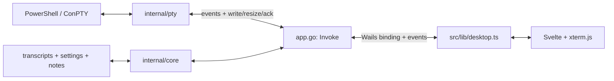

# Architecture

ATC is a Windows Go/Wails application with a Svelte 5 and xterm.js frontend.
Go owns ConPTY processes, transcript discovery, usage accounting, settings and notes.
The frontend owns terminal rendering, navigation, search, and saved tab descriptions.
The Go host replaced a Rust/Tauri one (0.3.1 and earlier). Its test suite was ported to
Go, and its index and cost output over the fixture corpus is frozen in
`fixtures/rust-contract.json`, which the Go tests must keep matching.

```mermaid
graph LR
  Shell[PowerShell / ConPTY] <--> PTY[internal/pty]
  PTY <-->|events + write/resize/ack| App[app.go: Invoke]
  Files[transcripts + settings + notes] <--> Core[internal/core]
  Core <--> App
  App <-->|Wails binding + events| Transport[src/lib/desktop.ts]
  Transport <--> UI[Svelte + xterm.js]
```

## Desktop boundary

`main.go` embeds `dist/`, creates the Wails window, and starts/stops `App`.
`app.go` exposes one `Invoke(command, args)` binding. `src/lib/ipc.ts` retains the typed
command contracts, while `src/lib/desktop.ts` implements Wails invocation, events,
PTY channels, notifications, native save dialogs and application zoom.
Command failures reject the frontend promise with a readable error.

A PTY channel subscribes before spawning. Output uses `{t:"o", d}` and exit uses
`{t:"x", code}` on its unique topic. The listener detaches on exit or failed spawn.
Ordinary change events are `index://updated`, `settings://updated`, and
`notes://updated`.

## Go modules

| File | Responsibility |
|---|---|
| `app.go` | Lifecycle, command dispatch, PTY registry, filesystem watching, migration |
| `limits.go` | Claude subscription HTTP request and Codex stdio app-server limits |
| `internal/pty/pty_windows.go` | Shell resolution, ConPTY, UTF-8 streaming, backpressure, process cleanup |
| `internal/pty/conpty.go` | Loads the bundled `conpty.dll` beside the exe, else the inbox ConPTY |
| `internal/core/settings.go` | Defaults, paths, atomic file persistence, command quoting |
| `internal/core/validate.go` | Settings JSON validation and legacy defaults |
| `internal/core/index.go` | Claude/Codex discovery, metadata, grouping, incremental disk cache |
| `internal/core/costs.go` | Incremental token accounting, deduplication and pricing |
| `internal/core/prices.json` | Baseline pricing, with config-directory overrides |

## Terminal transport

The native Windows implementation uses ConPTY. When `conpty.dll` and `OpenConsole.exe`
sit beside the exe, it uses them (Windows Terminal's newer ConPTY, fetched by
`scripts/conpty.mjs` at build time); otherwise it uses the one built into Windows,
which swallows OSC 10/11 colour queries. PowerShell 7 is
preferred, with Windows PowerShell as fallback. User profiles load normally;
`ATC_SHELL_NO_PROFILE=1` exists for deterministic tests. Launcher-only agent markers
and `NO_COLOR` are removed from child environments. `TERM=xterm-256color` is set.

A blocking reader sends 32 KiB buffers into a bounded 16-element queue. A pump decodes
UTF-8 across read boundaries, batches for 8 ms, and sends chunks of at most 7,900 bytes.
xterm acknowledges UTF-8 byte counts after parsing. The reader pauses above 2 MiB of
unacknowledged output and wakes below 256 KiB. This bounds buffering when rendering is
slow. A startup cursor-position watchdog prevents a missing initial terminal reply
from wedging ConPTY. Exit handling drains queued output before publishing exit.

Each tab has its own shell. Busy detection inspects child processes. Closing a busy tab
requires the existing confirmation dialog; confirmed closure terminates its process
tree. Application shutdown stops subscription helpers, watchers and all owned PTYs.

## Discovery and persistence

Claude reads a bounded head and a 64 KiB tail for current names. Codex reads complete
JSONL records incrementally, retaining partial-record offsets, stable native IDs,
activity and child links. File size and modification time invalidate cached entries.
`index-go.json` is separate from the old Rust cache and can always be regenerated.

Provider identity is `claude | codex`. UI identities are `provider:id`. Legacy bare
session IDs and rename keys represent Claude. Discovery groups canonical working
directories, applies pinned projects and renamed labels, and excludes child/archived
Codex sessions. Usage still includes child work attributed to its parent.

The watcher covers `settings.json`, `notes.md`, Claude project directories and Codex sessions/name
index. It watches existing ancestors when roots are absent and attaches new directories
as they appear. Events debounce for 300 ms. A rendered projection suppresses irrelevant
transcript growth events while preserving label, branch and activity changes.

Settings (`settings.json`) and the notes pad (`notes.md`) live in
`%APPDATA%\Agent Terminal Control`, overridden by `ATC_CONFIG_DIR`. Legacy settings
locations migrate on load. Tasks were retired (#140): when `notes.md` does not exist yet,
tasks from `tasks.json` (or left inside `settings.json`) are written into it once as a
checklist, and `tasks.json` is not touched. Invalid external settings edits leave the
current valid state intact. Atomic writes use unique temporary files and retry transient
Windows sharing conflicts. A disk mutex serializes saves and watcher reloads. Own saves
update the comparison snapshot, so they are not echoed back into an active editor.

The Wails WebView2 profile is `webview-wails` under the config directory. Browser-stored
state therefore survives Wails restarts and remains isolated in test profiles. Tauri's
previous-origin localStorage is not imported; users reopen their tabs once after migration.
Settings, project/session names, pins and transcript history remain available.

## Usage

Claude accounting deduplicates response records and handles cache reads and both cache
write durations. Codex prefers structured response usage after its first appearance;
legacy cumulative records apply before that boundary. Counter resets form new epochs.
Costs use exact model names or recognized dated snapshots. Unknown rates remain null
and flag partial totals. The frontend retains date ranges, grouping, charts and CSV.

Claude subscription credentials stay in Go. `CLAUDE_CONFIG_DIR` is honored, with
`~/.claude` as fallback. Codex starts its configured CLI in app-server mode, performs
initialize/initialized and `account/rateLimits/read`, and times out/cancels owned
processes. Neither provider's failure blocks the other's UI.

## Frontend and development

The existing Svelte components, pure helpers and xterm manager remain in `src/`.
`npm run desktop:dev` starts Wails development mode and Vite HMR. Go edits rebuild the
host; frontend edits use Vite. The development launcher mirrors Go sources into
`wails-dev-work/` so Wails does not recursively scan transient WebView profiles or
generated build trees. This directory is generated and ignored by Git. A full
page reload disposes the previous document's shells before restoring tabs; Vite HMR
within the same document keeps them. `npm run desktop:build` runs Vite and Wails packaging.
`npm run desktop:package` additionally creates MSI and NSIS installers.
Developer tools use Wails' native `Ctrl+Shift+F12` in debug builds.

`npm test` runs frontend and Go tests; build frontend assets once before Go tests on a
fresh checkout. `npm run test:e2e` drives a real WebView2 desktop window through
WebDriver and isolated fixtures. Its loader copy enables a local debugging endpoint
only in the E2E binary; it also records native-window screenshots and process-tree
memory in `benchmarks/`. See [the migration report](docs/WAILS-MIGRATION.md) for
results and verification limits.
